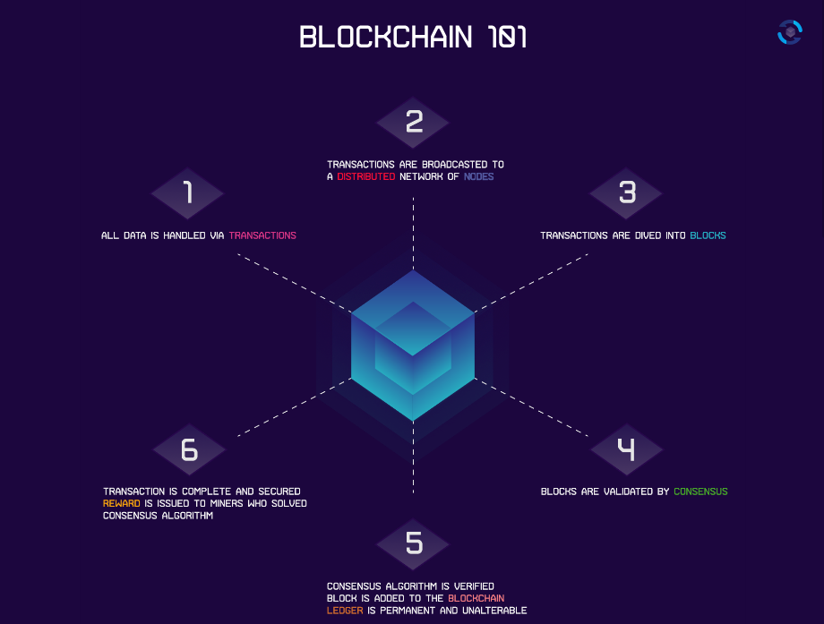
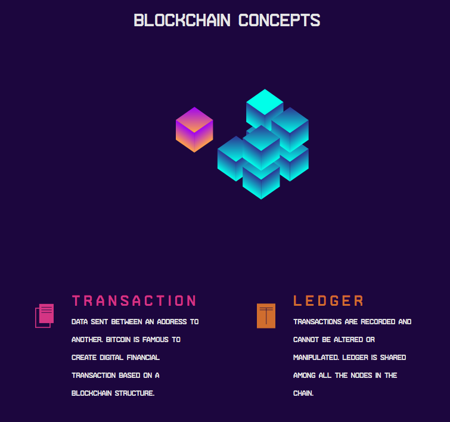
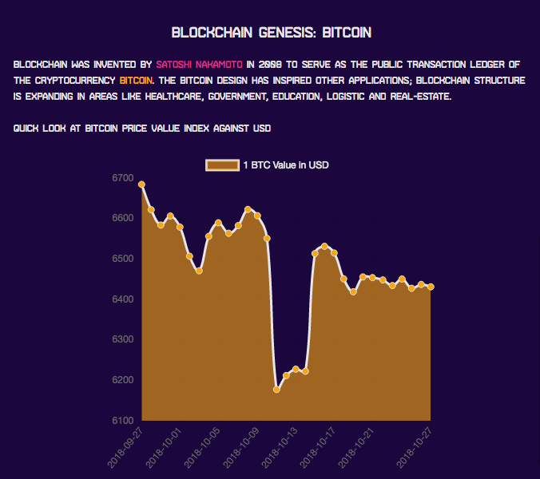

# Blockchain Infografic

### Infographic Build

Initial page for infographic has been built using Adobe Illustrator, and animated in Adobe After Effect.  Using AE extension 'bodymovin' https://github.com/airbnb/lottie-web  I have included the `data.json` file in my setup.

The Blockchain Concept section has been animated using sal.js library https://mciastek.github.io/sal/ 

In order to create and populate the chart, I have used the CoinDesk API https://www.coindesk.com/api/ which returns the bitcoin value against the USD in a one month period. 
The data has been retrieved using Javascript Fetch API, a big challenge was to create and populate the chart after the async operation run as a consequence of `fetch`.
Once the data has been retrieved, http://www.chartjs.org/ (Line Chart) has been used to show the data.
To keep the on scrolling animation even on the chart, I had to use a Chart.js plugin called `deferred` https://github.com/chartjs/chartjs-plugin-deferred 

### Project Ouline

The basis of this project is to take complex information – statistics, research
results, data comparison, forms, charts, analysis, etc., – and present it in the most
efficient and easily understood way possible. The specific difference between this
form of design and traditional infographics is the dynamic nature of the interactive
information design. In this context the complexity of information can parse both live
and static content from a variety of sources with realtime results. 
With the added feature of interactivity, information design can engage users in new
and interesting ways that traditional mediums, both static and dynamic, have been
limited in achieving. The added benefit of vector based design comes with the
inherent flexibility due to the algorithm of that graphic type. All aspects of it can be targeted and manipulated to any desired outcome.

Tools used during development phase:
- Adobe Illustrator
- Gulp.js
- SASS
- Javascript Fetch API, to get data from CoinDesk API https://www.coindesk.com/api/
- https://airbnb.design/lottie/ for animation created in Adobe After Effects
- http://www.chartjs.org/ to show data related to CoinDesk JSON results
- https://github.com/chartjs/chartjs-plugin-deferred to animate chart on scroll
- https://mciastek.github.io/sal/ to animate elements on scroll

### Giving credits for places that helped to do this project

- https://stackoverflow.com/
- https://github.com/
- https://sass-lang.com/

### Future Improvements
- Animations improvements
- Further refactoring SASS structure
- More Bitcoin API can be access to retrieve further data.